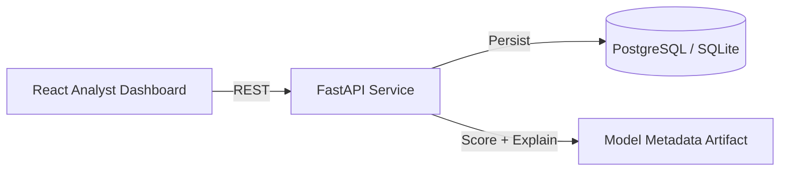

# FraudShield

I built FraudShield as a bank-style fraud detection platform to show how I think about backend engineering, ML integration, and product design in one project. It simulates real-time card transaction scoring, creates alerts for suspicious activity, gives an analyst a workflow to review those alerts, and exposes operational metrics so the system feels like a real product instead of a standalone model demo.

I designed it around the kind of problems I would expect in a financial services environment: risk scoring, alert triage, auditability, explainability, and operational visibility.

## What it does

1. Accepts a transaction through a REST API.
2. Scores the transaction using a versioned model artifact generated by the ML pipeline.
3. Returns a `risk_score`, `risk_band`, and the top factors that influenced the decision.
4. Persists the transaction and opens an alert automatically if the score crosses the configured threshold.
5. Lets an analyst mark the case as fraud, mark it as legitimate, or escalate it.
6. Tracks metrics like alert volume, review precision proxy, latency, and lightweight drift indicators.

## Why I built it this way

- I wanted one project that covered backend, frontend, data, testing, and deployment.
- I wanted the ML part to be integrated into an application instead of sitting in a notebook.
- I wanted the repo to support a strong technical walkthrough around tradeoffs, not just features.
- I wanted the project to look honest and reproducible, so I used synthetic and deterministic fraud-style data rather than pretending to have real bank data.

## Architecture



## Repo layout

- `backend/`: FastAPI service for scoring, alerting, metrics, persistence, and audit history
- `frontend/`: React + TypeScript analyst dashboard
- `ml/`: training and evaluation pipeline that generates model metadata
- `.github/workflows/ci.yml`: CI checks for backend, ML, and frontend
- `docker-compose.yml`: local multi-service run path

## Main technical choices

- Backend: FastAPI + SQLAlchemy
- Database: SQLite locally, PostgreSQL in Docker Compose
- Frontend: React + TypeScript + Vite
- ML: scikit-learn logistic regression baseline with exported metadata
- Testing: `unittest` + `httpx` for backend, Vitest for frontend
- Delivery: Dockerfiles and GitHub Actions

## API

- `POST /api/v1/transactions/score`
- `GET /api/v1/alerts`
- `GET /api/v1/alerts/{id}`
- `POST /api/v1/alerts/{id}/decision`
- `GET /api/v1/metrics/overview`
- `GET /api/v1/health`

## Example score response

```json
{
  "transaction_id": "1aa0f2de-8e4d-41fd-a078-1d6a1948bb8a",
  "alert_id": "b0d9f918-50a7-4fd0-875e-92e8408d04c5",
  "risk_score": 0.9132,
  "risk_band": "high",
  "top_factors": [
    {
      "feature": "ip_risk_score",
      "label": "Risky IP or device fingerprint",
      "contribution": 1.92,
      "direction": "increase"
    }
  ],
  "model_version": "logreg-2026.03.06",
  "latency_ms": 18.4
}
```

## Running it locally

One command from the repo root:

```powershell
.\scripts\start-local.ps1
```

That script finds free local ports automatically, starts the backend and frontend in the background, and prints the URLs to use.

Stop the local processes:

```powershell
.\scripts\stop-local.ps1
```

Inspect a port owner:

```powershell
.\scripts\inspect-port.ps1 -Port 8000
```

Backend:

```bash
cd backend
python -m venv .venv
. .venv/Scripts/activate
pip install -r requirements.txt
uvicorn app.main:app --reload --port 8010
```

Frontend:

```bash
cd frontend
npm install
set VITE_API_BASE_URL=http://127.0.0.1:8010
npm run dev -- --port 4173
```

Refresh the model artifact:

```bash
cd ml
pip install -r requirements.txt
python -m fraudshield_ml.train
```

Run the full stack:

```bash
docker compose up --build
```

In Docker Compose, the frontend is exposed on `http://localhost:4173` and the backend on `http://localhost:8010`.
The Docker frontend now serves a production build instead of a Vite dev server.

The backend seeds deterministic demo transactions on startup so the dashboard has alerts available immediately.

## Verification

Backend:

```bash
cd backend
python -m unittest discover -s tests -v
```

ML:

```bash
cd ml
python -m fraudshield_ml.train --check
```

Frontend:

```bash
cd frontend
npm install
npm run test -- --run
npm run build
```

## What I focused on

- Clear API contracts and validation
- Simple but explainable scoring logic
- Alert review workflow with auditable analyst decisions
- Operational metrics instead of model score alone
- A project structure that is easy to run, inspect, and discuss

## Tradeoffs

- I used SQLite as the local default to reduce setup friction, but included PostgreSQL in Docker Compose for a more realistic service setup.
- I export model metadata rather than serving a heavy serialized runtime model because it keeps the scoring path transparent and easy to inspect.
- Authentication is intentionally lightweight in this version because I wanted to prioritize core product and engineering flow first.

## Note

This is a simulated fraud operations project for portfolio and learning purposes. It is not based on proprietary banking data and is not presented as a production banking system.
